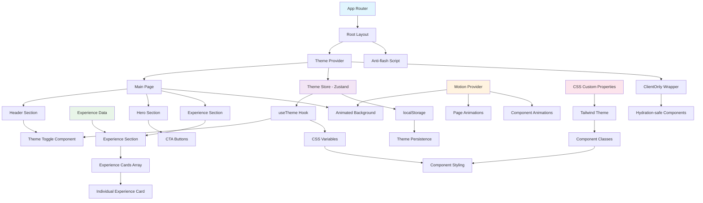

# 🚀 Modern Portfolio Website

A cutting-edge portfolio website built with **Next.js 15**, **TypeScript**, **Tailwind CSS**, and **Motion** (Framer Motion). Features a sophisticated theme system, animated backgrounds, and a professional experience showcase.

## ✨ Features

### 🎨 **Advanced Theme System**
- **Light/Dark/Auto modes** with system preference detection
- **SSR-safe theme persistence** using localStorage
- **Smooth transitions** between themes
- **Custom CSS variables** for consistent theming
- **Anti-flash script** prevents theme flickering on page load

### 🎭 **Motion Animations**
- **Animated background** with floating geometric shapes
- **Smooth scroll-triggered animations** using Intersection Observer
- **Interactive hover effects** with scale and transform animations
- **Staggered animations** for content sections
- **Performance-optimized** 60fps animations

### 🧩 **Component Architecture**
- **Modular component library** inspired by modern design systems
- **TypeScript interfaces** for type safety
- **Reusable Button component** with 7 variants and multiple sizes
- **Custom hooks** for theme management
- **SSR-compatible** client-side rendering patterns

### 📱 **Responsive Design**
- **Mobile-first approach** with Tailwind CSS
- **Flexible grid layouts** that adapt to all screen sizes
- **Touch-friendly interactions** on mobile devices
- **Optimized typography** scaling across devices

## 🛠️ Tech Stack

| Category | Technologies |
|----------|-------------|
| **Framework** | Next.js 15 with App Router |
| **Language** | TypeScript |
| **Styling** | Tailwind CSS 4 |
| **Animations** | Motion (Framer Motion) |
| **State Management** | Zustand |
| **Development** | ESLint, Turbopack |

## 📊 Application Architecture



## 🏗️ Project Structure

```
app/
├── shared/
│   ├── components/           # Reusable components
│   │   ├── AnimatedBackground/
│   │   │   ├── AnimatedBackground.tsx
│   │   │   └── index.ts
│   │   ├── Button/
│   │   │   ├── Button.tsx    # Main button component
│   │   │   ├── helper.ts     # Color variants logic
│   │   │   └── types.ts      # TypeScript interfaces
│   │   ├── ClientOnly/
│   │   │   ├── ClientOnly.tsx # SSR-safe wrapper
│   │   │   └── index.ts
│   │   ├── Experience/
│   │   │   ├── Experience.tsx # Main experience section
│   │   │   └── index.ts
│   │   ├── ExperienceCard/
│   │   │   ├── ExperienceCard.tsx # Individual job cards
│   │   │   └── index.ts
│   │   ├── ThemeProvider/
│   │   │   ├── ThemeProvider.tsx # Theme context provider
│   │   │   └── index.ts
│   │   └── ThemeToggle/
│   │       ├── ThemeToggle.tsx # Theme switcher UI
│   │       └── index.ts
│   ├── constants/
│   │   └── colors.ts         # Color system constants
│   ├── data/
│   │   └── experience.ts     # Professional experience data
│   ├── hooks/
│   │   └── useTheme.ts       # Custom theme hook
│   └── stores/
│       └── themeStore.ts     # Zustand theme store
├── globals.css               # Global styles & CSS variables
├── layout.tsx               # Root layout with providers
└── page.tsx                 # Main page component
```

## 🎯 Component Features

### **Button Component**
- **7 variants**: solid, bordered, light, flat, faded, shadow, ghost
- **6 color schemes**: primary, secondary, success, warning, danger, default
- **4 sizes**: sm, md, lg, xl
- **Loading states** with spinner animation
- **Icon support** with proper spacing

### **Theme System**
- **Auto-detection** of system preference
- **Smooth transitions** between theme changes
- **Persistent state** across browser sessions
- **SSR-compatible** implementation

### **Experience Cards**
- **Professional job history** with detailed descriptions
- **Technology badges** with hover animations
- **Responsive layout** (grid → single column on mobile)
- **Motion animations** on scroll and hover

### **Animated Background**
- **Floating geometric shapes** with organic motion paths
- **Glowing orbs** with radial gradients
- **Subtle grid pattern** for visual depth
- **Theme-aware colors** that adapt automatically

## 🚀 Getting Started

### Prerequisites
- Node.js 18+ 
- npm, yarn, pnpm, or bun

### Installation

1. **Clone the repository**
   ```bash
   git clone <repository-url>
   cd blog-portolio
   ```

2. **Install dependencies**
   ```bash
   npm install
   # or
   yarn install
   # or
   pnpm install
   # or
   bun install
   ```

3. **Run the development server**
   ```bash
   npm run dev
   # or
   yarn dev
   # or
   pnpm dev
   # or
   bun dev
   ```

4. **Open your browser**
   Navigate to [http://localhost:3000](http://localhost:3000)

### Build Commands

```bash
# Development server with Turbopack
npm run dev

# Production build with Turbopack
npm run build

# Start production server
npm run start

# Run ESLint
npm run lint
```

## 🎨 Customization

### **Theme Colors**
Modify the CSS custom properties in `app/globals.css`:

```css
:root {
  --primary-500: #3b82f6;    /* Primary blue */
  --secondary-500: #64748b;  /* Secondary gray */
  --success-500: #22c55e;    /* Success green */
  /* ... more colors */
}
```

### **Experience Data**
Update your professional experience in `app/shared/data/experience.ts`:

```typescript
export const experienceData: Experience[] = [
  {
    company: "Your Company",
    position: "Your Position",
    duration: "2 years",
    startDate: "2022-01",
    endDate: "Present",
    technologies: ["React", "TypeScript", "Next.js"],
    description: [
      "Your key achievements and responsibilities"
    ]
  }
];
```

### **Animation Settings**
Adjust animation parameters in component files:

```typescript
// Example: Modify background animation speed
transition={{
  duration: 25, // Increase for slower animation
  repeat: Infinity,
  ease: "easeInOut",
}}
```

## 🔧 Configuration Files

- **`next.config.ts`** - Next.js configuration with Turbopack
- **`tailwind.config.js`** - Tailwind CSS configuration
- **`tsconfig.json`** - TypeScript configuration
- **`eslint.config.mjs`** - ESLint rules and settings
- **`postcss.config.mjs`** - PostCSS configuration

## 📈 Performance Features

- **Turbopack** for fast development and builds
- **SSR optimization** with proper hydration handling
- **CSS-in-JS performance** using CSS custom properties
- **Animation optimization** with `will-change` and GPU acceleration
- **Bundle optimization** with Next.js automatic code splitting

## 🎯 SEO & Accessibility

- **Semantic HTML** structure for better SEO
- **Proper heading hierarchy** (h1, h2, h3)
- **Alt text** for images and icons
- **Keyboard navigation** support
- **Screen reader** friendly components
- **Color contrast** compliance
- **Responsive meta tags** for mobile optimization

## 🚀 Deployment

### **Vercel (Recommended)**
```bash
# Install Vercel CLI
npm i -g vercel

# Deploy to Vercel
vercel
```

### **Other Platforms**
The app is compatible with any platform that supports Next.js:
- Netlify
- Cloudflare Pages
- AWS Amplify
- Railway
- Render

## 🤝 Contributing

1. Fork the repository
2. Create your feature branch (`git checkout -b feature/AmazingFeature`)
3. Commit your changes (`git commit -m 'Add some AmazingFeature'`)
4. Push to the branch (`git push origin feature/AmazingFeature`)
5. Open a Pull Request

## 📄 License

This project is open source and available under the [MIT License](LICENSE).

## 🙏 Acknowledgments

- **Next.js Team** for the amazing React framework
- **Tailwind CSS** for the utility-first CSS framework
- **Motion Team** for the smooth animation library
- **Zustand** for simple state management
- **Vercel** for the deployment platform

---

**Built with ❤️ using modern web technologies**